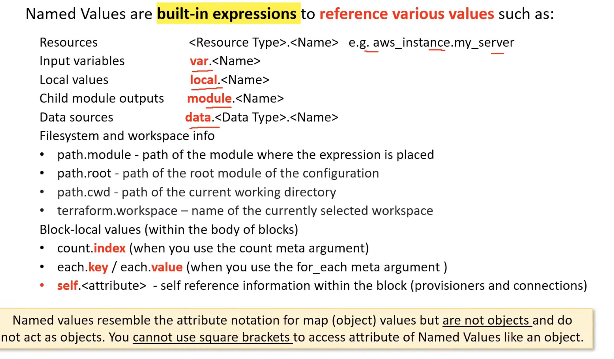

tf workspace list

APi key for cloud: /Users/felix/.terraform.d/credentials.tfrc.json

To SSH after deploying
``` 
chmod 400 my_aws_key.pem && ssh -i "my_aws_key.pem" ec2-user@$(terraform output -raw instance_public_dns)
```

```
terraform refresh
terraform providers
terraform output <name of output>
terraform output -raw <name of output>

erraform apply --replace="aws_instance.app_server"
```



Vars precendence 
```
Environment variables
The terraform.tfvars file, if present.
The terraform.tfvars.json file, if present.
Any *.auto.tfvars or *.auto.tfvars.json files, processed in lexical order of their filenames.
Any -var and -var-file options on the command line, in the order they are provided. (This includes variables set by a Terraform Cloud workspace.)
```


terraform output -json | jq '.'

```
User data 
 When a user data script is processed,
it is copied to and run from /var/lib/cloud/instances/instance-id/. 
The script is not deleted after it is run and can be found in this directory with the name user-data.txt 
So to check if your shell script made to the server refer this directory and the file.
The cloud-init output log file (/var/log/cloud-init-output.log) captures console output of your user_data shell script.to know how your user_data shell script was executed and its output check this file.
```


### State handling 

replace, if resource is damaaged

tf apply -replace=aws_instance.my_server


refesh to update state file

tf apply - assumes state files is correct
tf apply --refresh-only - assumes state file is wrong


import 


Logging

`TF_LOG=TRACE TF_LOG_PATH=./tf.log tfaa`


Module structure


Standard backends - only stores state
Enhanced backends - store state and runcommands

# workspaces

terraform workspace new production - with s3 backend auto creates folder for priduction workspace

{terraform.workspace}


Force unlock 
`tf force-unlock ID` - to override 


timeouts {} block, after which considered failed


Complex types: List, map, set 

Structural types: object, tuple

type({
    a= string
    b= optional(string)
})


### Built in functions

chomp() - rm \n from start
format()

lookup({}, key, default_value )


can(this.htat.final_thing) =